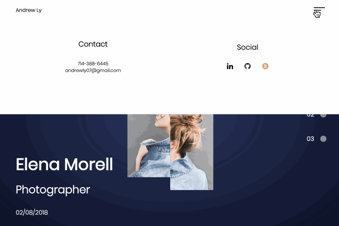

# Mock-Portfolio
A series of three portfolios for use.
# Animus Match
* Live Demo: __https://mock-portfolio.andrewly.dev/__


<hr/>

This application contains a series of three portfolios designed for artists, professionals, and those who wish to showcase their stories.

## Getting Started
### Initial Setup
1. Fork this repo and clone your fork from the terminal.
```
$ git clone https://github.com/andrewly07/mock-portfolio.git
```
2. Navigate to and open the ```/mock-portfolio``` directory.
3. Open the ```index.html``` file and enjoy! 

## Built With
* [Core JavaScript](https://www.ecma-international.org/publications/standards/Ecma-262.htm)
* HTML
* CSS

## License
[MIT License](https://opensource.org/licenses/mit-license.php)

[](https://opensource.org/licenses/mit-license.php)
